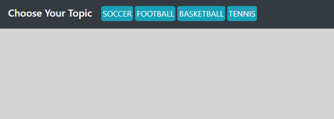

# GifTastic

### Overview

    Using the GIPHY API to make a dynamic web page that populates with gifs of your choice.

### Access to GifTastic

    1a. Remote Access
        * Access webpage using the following link https://tomaszchylinski.github.io/GifTastic/

    1b. Local Acess
        * Git clone https://github.com/TomaszChylinski/GifTastic.git on to your local machine.
        * Once downloaded run index.html in your favorite browser.

### How to play:

    1a. Using prepopulated navigation bar
        * Click on the topic of your choice.

    

        * Once clicked on the navigation bar, gif(s) related to the topic will populate the webpage (please note that current retrun of gifs is set to ten max).
            - The image below is an example of two gifs that were populated after clicking the Basketball tab.
                
        
        * Once gif(s) appear on the page, users are able to click on the gif of their choice. This action will change the state of the gif, from still to animate. 
          In turn this action will allow the gif to either be still or animated on the page. 

    1.b. Search for your own topic -
       

    2. Click on the gify of your choice -
